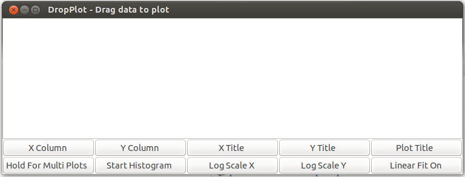

DropPlot
==========

Plots data which is dragged and dropped into window. Uses wx,numpy, and matplotlib.

Setup 
------
You can make sure some dependencies by using the installDependencies.sh script as sudo

sudo sh installDependencies.sh

Choose a directory to place files in then run

sh setupAlias.sh

to setup dropplot command in terminal

and

sh makeDesktopFile.sh

to create a desktop file which should be draggable into your launcher or placed in ~/.config/autostart if looking for autostart 

sh make

Directory plot parameter files 
------
If directory of the dragged gile contains a file called plotparams.dat 

then 

plot parameters will be set based on parsed file.

plotparams.dat example contents
------
xTitle(some x axis) # x axis title "some x axis"

yTitle(y label here) # y axis title "y label here"

plotTitle(new plot) # plot title "new plot"

xCol(1) # x axis data is second column

yCol(0) # y axis data is first column

xLog() # plot x-axis using log scale

yLog() # plot y-axis using log scale

fit(0:50) # do a linear fit for first 50 columns

histogram() # plot histograms

Data labels in file name
------

if drag dropped filename has "-label(++)" in the filename the parentheses+ will label the data.

-label(+my data+)

will label the data as "my data".

GUI image
------

